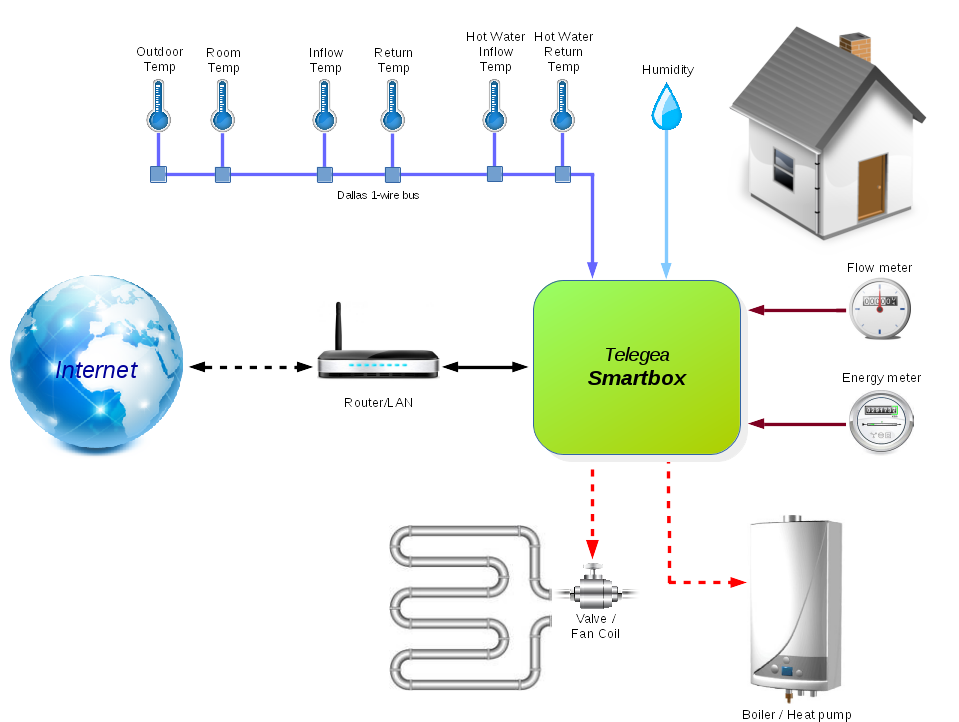

# Overview

In order to start using the *Telegea* platform and its applications, some initial hardware setup is necessary. Namely, e few sensors, possibly also flow and energy meters and a small device called **Smartbox** is needed which collects the sensor and meter data and controls connected appliances.  

Once the hardware is set up and the Smartbox is connected to the sensors (temperature and humidity) and meters (energy and water flow), it will start collecting and recording data. With an active Internet connection, it can also send this data to the Telegea server where the user can access and visualize it via an intuitive Web GUI.  

The following picture shows a typical deployment scenario for a *Telegea* application monitoring a simple thermal plant in a private home. In addition to the monitoring function, it is also possible to control the plant by switching on/off the boiler or heat pump and opening/closing the valve controlling the flow of the heating/cooling circuit. This can be done manually from a remote location or automatically by the Smartbox device itself.

  

 

Although this is a typical use case, the *Telegea* platform is a highly flexible system which can easily be adapted to many different scenarios. So the combination of sensors, meters and controlled appliances is limited only by your immagination.  
In the following, it will be explained in detail how the hardware setup can be done, step by step.  

 

# Smartbox

The Smartbox device can be realized in two ways.  

### Build your own

The Smartbox can be assembled the "do it yourself" way from commercially available components.
See [this guide](02-smartbox-diy-building-instructions.md) if you chose to go down this road.  

### Buy a complete Smartbox *(coming soon)*

We are developing a custom hardware which can be purchased as a complete turnkey solution. It includes on-board relays, sensors and all neccessary connectors for external components. It is also provided with the Telegea Smartbox software installed and ready to use.

It has the following features:  
* Based on RaspberryPi Compute Module
* On board temperature and humidity sensor
* 4 on board relays for boiler / heat pump control
* Real time clock for time keeping during reboot and power off
* 2 configurable RJ11 sensor connectors for external sensors
* XRF radio module for connectivity with wireless sensors
* 8 digital inputs for pulse counting or status signals
* RS485 interface for communication with Modbus devices
* Ethernet connector
* Wifi module *(optional)*
* 2.8" Touchscreen *(optional)*
* Wall mount or DIN rail enclosure

 

# Sensors  
See the [Sensors Guide](03-sensors.md) for a description on which sensor are supported and how to wire them.  

 

# Meters  
See the [Meters Guide](04-meters.md) for a description on which meters are supported and how to wire them.

