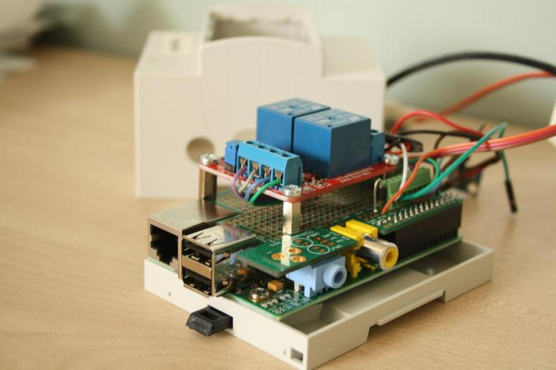
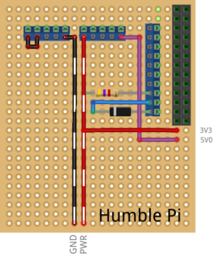
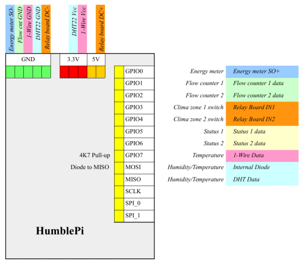

# Smartbox DIY: building instructions

The smartbox can be built from commercially available components. These instructions provide a step by step guide to assemble the data acquisition device which is ready to be connected to the Telegea platform.  

The picture shows the complete assembled device mounted in the DIN rail eclosure.

  
  
 

### List of components:

This is the list of needed components with direct links to online shops where they can be purchesed.  

* RaspberryPi model B 
* [Humble Pi add-on board](https://www.wirelessthings.net/humble-pi)
* [2-channel relay board](http://www.plexishop.it/it/robotica-ed-automazione/moduli-rele-e-mosfet/schede-rele/modulo-2-rele-optoisolato.html)
* [Screw terminals](http://it.rs-online.com/web/p/blocchetti-terminali-da-pcb/2204355/)
* [DIN rail mounting enclosure](http://yadom.fr/boitiers/boitiers-raspberry/raspberry-pi-a-b/boitier-pour-raspberry-pi-montage-rail-din-v2-piface.html)
* [1-wire temperature sensor DS18B20](https://www.adafruit.com/products/381)
* [1-wire temperature/humidity sensor DHT22](https://www.adafruit.com/products/393)
  
 

### RaspberryPi 

The Smartbox is based on the popular RaspberryPi credit card size computer. This "do-it-yourself" project uses the V1, model B version, mainly for compatibility with the Humble Pi add-on board. But generally, also later RaspberryPi version can be used.  

### Humble Pi add-on board

The HumblePi add on board is a general purpose breadboard which can be connected to the GPIO pin header P1 of the RaspberryPi. For the deployment with the Telegea Smartbox, additional screw terminals need to be mounted on the board to be able to easily connect the needed sensors and relays.  

* [1 10-way screw terminal](http://it.rs-online.com/web/p/blocchetti-terminali-da-pcb/2204355/)
* [2 5-way screw terminals](http://it.rs-online.com/web/p/blocchetti-terminali-da-pcb/7901105/)

Additionally, a 4K7 Ohm resistor is needed as pull-up for the 1-wire temperature bus and a diode for connecting the DHT22 humidity sensor and two wires to connect the 3.3V and 5V from the P1 connector to the corresponding screw terminals.  

The following picture shows the breadboard view with the mounted screw terminals and components on top and the additional connections (3.3V, 5V) made on the bottom of the board.  
  
  
  
 

The picture below shows the connections of the external sensors and counters to the screw terminals. This is the scheme for the general purpose deployment of the Smartbox. It can also be customised for specific applications, changing the number or type of sensors, relays, etc...  
  
  

 

### 2-channel relay board

The relay board is optional and only needs to be mounted if the control features of the Smartbox is needed (e.g. for the thermostat application).  

First some standoffs (8mm height) will be screwed to the bottom of the relay board, using the 4 holes at each corner. Then the card can be screwed onto the Humble Pi using the existing hole at the bottom left and drilling another hole at the top right position.  

Once the relay board is fixed to the Humble Pi, the power supply and control lines need to be connected as shown in the picture above.  

 

### Temperature sensors

The DS18B20 1-wire temperature sensors can be connected on a 1-wire bus. Up to 10 sensors can easily be handled. It is convenient to use the water proof version whitch is provided with a 3-wire cable which is used for the data line and power supply. This cable should be connected to an RJ11 plug for easy installation of the bus, using 1 to 2 Female RJ11 splitters.  

 

### Temperature/Humidity sensors

The DHT22 sensor also uses a 1-wire protocol but doesn't support a master/slave architecture and therefore cannot be connected together with other sensors on the same bus. That means one GPIO pin is needed for each DHT22 sensor. This sensor doesn't support long cables and should be located close to the Smartbox (<1m).  

 

### DIN rail mounting enclosure

When the completely assembled Humble Pi board is mounted on top of the RaspberryPi, it can be screwed onto the bottom plate of the enclosure. Before closing the case, the sensor and counter cables need to be connected to the screw terminals according to the above scheme and passed through the holes of the enclosure lid.  

