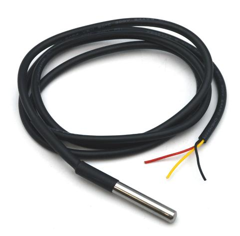
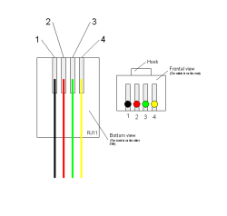
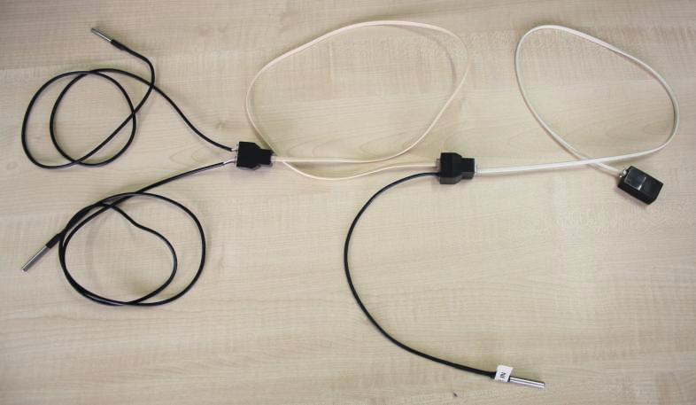
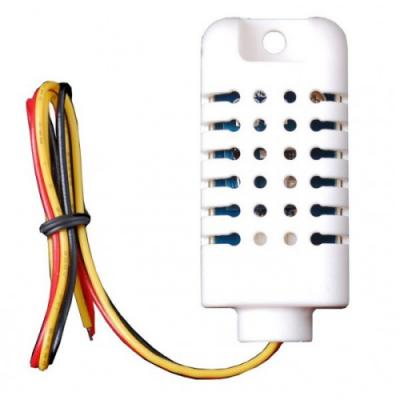
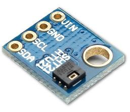

# Sensors

The Telegea platform currently supports the following sensors:

* DS18B20 1-wire temperature sensor
* DHT22/AM2303 1-wire temperature/humidity sensor
* SHT21 temperature/humidity sensor
* Wireless sensors (XRF modules)

 

### Temperature sensors

The **DS18B20 1-wire temperature sensor** can be connected on a 1-wire bus. Each sensor has a unique ID built in. Up to 10 sensors can easily be handled. It is convenient to use the water proof version of the sensor which is provided with a 3-wire cable (data line and power supply).  

The cable should be connected to an RJ11 plug for easy installation of the bus as shown below.  

  

|Pin | Wire   | Description|
|----|--------|------------|
|(1) | Black  | Ground     |
|(2) | Red    | Vcc (3.3V) |
|(3) | Green  | Data       |
|(4) | Yellow | Not used   |  

The bus itself can be realized using a standard 4-wire flat telephone cable with RJ11 plugs on each end. The cables and sensors are connected with each other with 1-to-2 Female RJ11 splitters.  

 

### Temperature/Humidity sensors

The **DHT22/AM2303 sensor** provides both temperature and humidity measurements and also uses a 1-wire protocol. But it doesn't support a master/slave architecture and therefore cannot be connected together with other sensors on the same bus. That means one dedicated GPIO pin is needed for each sensor. This sensor doesn't support long cables and should be located close to the Smartbox (<1m) to allow for reliable sensor readings.  
The wires can be connected directly to the GPIO screw terminals of the Smartbox or using an RJ11 plug appropriately connected as shown for the DS18B20 sensor.  

The **SHT21 sensor** also provides temperature and humidity measurements but uses a 2-wire I2C bus interface. This is more reliable then the 1-wire bus but needs an additional clock wire. All sensors are provided with the same fixed I2C bus address which cannot be changed and therefore multiple sensors cannot be used on the same bus. Two dedicated GPIO pins are needed for each sensor.  
There are different enclosed products available which integrate this sensor chip. For test or indoor purpose, a breakout board with the mounted sensor is a possible solution. In this case the 4 necessay wires (data, clock and power supply) need to be soldered to the sensor board at one end and connectoed to the screw terminals of the Smartbox at the other end.

 

### Wireless sensors

The wireless sensors can be used if the Smartbox is equipped with an [XRF Wireless Data Module](https://www.wirelessthings.net/xrf-wireless-rf-radio-uart-serial-data-module-xbee-shaped).  
A possible sensor to be installed is the [Ambient Temperature Sensor](https://www.wirelessthings.net/wireless-temperature-sensor). It can be placed anywhere in the range of the radio transceiver mounted on the Smartbox. It is possible to use multiple sensors.  

