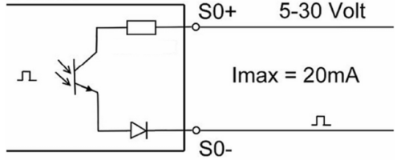

# Meters

The Telegea Smartbox interfaces with the following meter types:
* Meter with (S0) pulse interface
* Meter with Modbus interface

### Pulse Interface

Meters with pulse interface are usually energy meters which generate a pulse for a number of kWh. The pulse is generated within the meter with an open collector circuit as shown below.  

  

To connect such an energy meter to the Smartbox two wires are needed, S0+ goes to the screw terminal counter input and S0- to the ground connector on the Smartbox. 

Flow counters typically use a potential free mechanical or magnetic switch. In this case the two wires are connected to the screw terminal counter input and to the ground connector on the Smartbox respectively. The wires can be swapped.

### Modbus interface

More sophisticated meters provide a Modbus interface which gives access to a number of measurements (specified in the meters manual). The interface uses a RS485 serial line which has 3 wires (data+, data- and ground). The Smartbox can connect to these meters via it's own RS485 interface. Just connect the data lines A, B and the ground wire between the Smartbox and the meters screw terminals.

